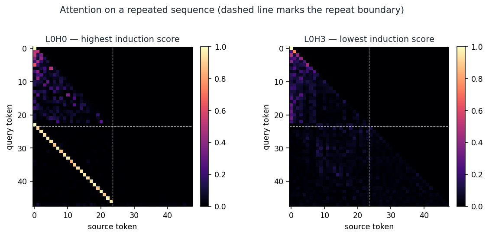
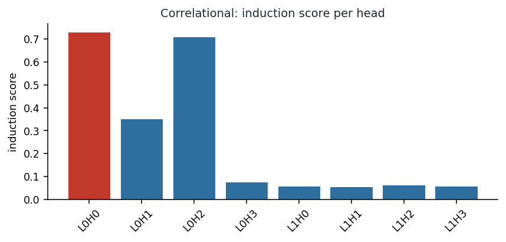
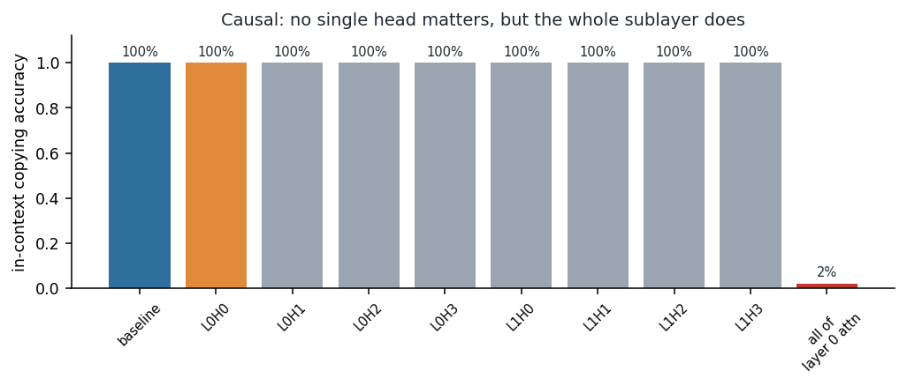
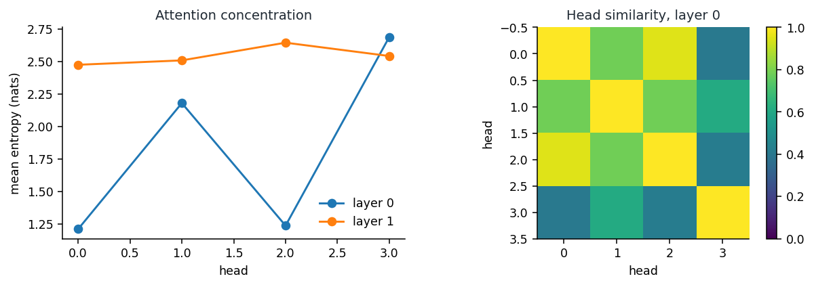
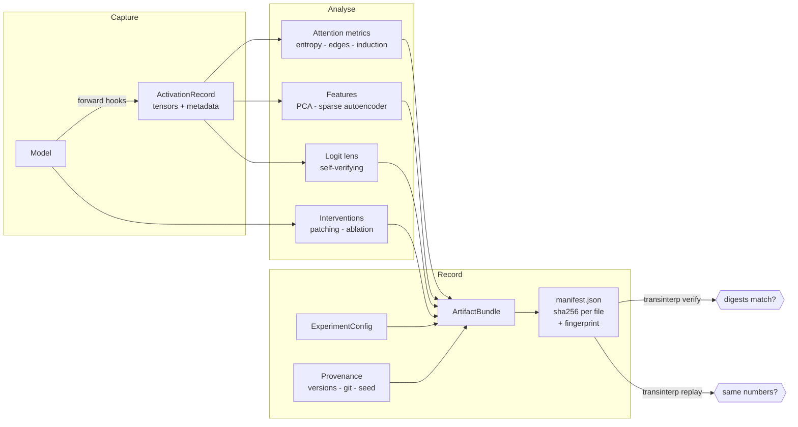

# TransInterp

[](https://github.com/Zoe4370/TransInterp/actions/workflows/ci.yml)
[](LICENSE)
[](https://www.python.org/)
[](tests/)

**Reproducible interpretability experiments: run, verify, and replay activation patching with content-addressed artifacts.**

TransInterp captures Transformer internals, runs causal interventions on them,
and writes the whole thing to a content-addressed bundle: activations, config,
metrics, and the exact software environment. One command runs an experiment.
Another replays it and tells you whether the numbers came back the same — and
if not, what changed.

```bash
transinterp run experiment.yaml       # -> artifacts/my-experiment/
transinterp replay artifacts/my-experiment
# reproduced exactly (fingerprint 94a2822b1853)
```

---

## Why this exists

Mechanistic interpretability has good methods and weak provenance. Results
live in notebooks, and when two studies disagree it can take a third paper to
work out that they were measuring different things. TransInterp treats the
experiment record as the deliverable rather than the plot.

Concretely, every result carries:

- the config that produced it, re-executable without the original script
- SHA-256 digests per file plus one fingerprint for the run
- torch/transformers/Python versions, platform, git commit and dirty flag
- the seed and exactly which determinism controls were applied
- the stated hypothesis — or an explicit note that there wasn't one

## A worked example

`examples/induction_experiment.py` trains a two-layer transformer on a
repeated-sequence task until it copies in context perfectly, then uses
TransInterp to ask which heads are responsible. It runs in about a minute and
downloads nothing.

```bash
python examples/induction_experiment.py --figures assets/
```

**Step 1 — look at the attention.** One head shows the textbook induction
stripe: after the sequence repeats, it attends back to the token that followed
the earlier copy. A low-scoring head in the same layer is diffuse by
comparison.



**Step 2 — score every head.** `induction_head_score` ranks L0H0 highest.



At this point the tempting write-up is "L0H0 is the induction head." That
would be wrong.

**Step 3 — intervene.** Ablating L0H0 changes nothing. Ablating *any* single
head changes nothing. Ablating all of layer 0's attention collapses accuracy
from 100% to 2%.



The behaviour depends on that sublayer but on no individual head — the
mechanism is redundant, and four heads cover for each other. The attention
pattern was real, and the causal story it suggested was not. Only the
intervention distinguishes them, which is why this library treats patterns as
evidence and interventions as the test.

One caveat travels with this result, as it should: the task repeats at a fixed
offset, so a head that simply attends a fixed distance back would also score
as induction here. Separating genuine content-based induction from a
positional shortcut needs variable repeat offsets as a control.

## How it compares

TransInterp is not trying to replace the established tools, and for most
circuit work you should reach for them first.

| | TransInterp | TransformerLens | nnsight | SAELens |
|---|---|---|---|---|
| Activation capture | yes | yes | yes | via others |
| Activation patching | yes | yes | yes | — |
| SAE training | inference + loss only | — | — | **yes** |
| Remote / 70B+ models | no | no | **yes** | — |
| Model coverage | HF causal LMs | very broad | any PyTorch | broad |
| Content-addressed artifacts | **yes** | no | no | no |
| One-command replay + diff | **yes** | no | no | no |
| Self-verifying logit lens | **yes** | no | no | — |
| Maturity | new | ~3.8k★ | ~970★ | ~1.5k★ |

Use TransformerLens for breadth of circuit tooling, nnsight for large or
remote models, SAELens for dictionary learning. Use TransInterp when the
result needs to survive review — or use it alongside them and let it own the
record.

## Install

For users, install the published package directly from PyPI:

```bash
python -m venv .venv && source .venv/bin/activate
python -m pip install transinterp
```

For contributors who want the development dependencies:

```bash
git clone https://github.com/Zoe4370/TransInterp.git
cd TransInterp
python -m venv .venv && source .venv/bin/activate
python -m pip install -e '.[dev]'
```

Install the PyTorch build matching your CUDA version first if you want GPU.
See [docs/SETUP.md](docs/SETUP.md).

## Quick start

Two examples run in seconds and download nothing:

```bash
python examples/basic_usage.py
python examples/reproducible_experiment.py
```

### Run an experiment

```yaml
# experiment.yaml
name: ioi-probe
hypothesis: >
  Layer 9 attention carries the name information. Falsified if patching it
  restores under 20% of the clean logit difference.
model:
  name_or_path: distilgpt2
input:
  prompts: ["When John and Mary went to the store, John gave a drink to"]
  corrupted_prompts: ["When Alice and Bob went to the store, Alice gave a drink to"]
analysis:
  patching:
    enabled: true
    correct_token: " Mary"
    incorrect_token: " John"
```

```bash
transinterp run experiment.yaml
transinterp inspect artifacts/ioi-probe    # provenance, metrics, tensors
transinterp verify  artifacts/ioi-probe    # digests still match?
transinterp replay  artifacts/ioi-probe    # same numbers on this machine?
```

`verify` catches modified, deleted, and added files. `replay` re-runs from the
stored config and, when results differ, prints the environment differences
that most likely explain it.

### Causal interventions

Patching executes here — it runs the model with a modified internal state
rather than ranking numbers you computed elsewhere.

```python
from transinterp.interventions import logit_difference
from transinterp.models import HuggingFaceCausalLM

model = HuggingFaceCausalLM.from_pretrained("distilgpt2", device="cpu")
clean = model.tokenize("When John and Mary went out, John gave a drink to")
corrupt = model.tokenize("When Alice and Bob went out, Alice gave a drink to")

results = model.patcher().scan(
    clean_run=lambda: model.model(**clean),
    corrupted_run=lambda: model.model(**corrupt),
    metric=lambda out: logit_difference(out.logits, mary_id, john_id),
)
for r in results[:5]:
    print(f"{r.component:22} restored {r.normalized:+.1%}")
```

`mode="replace"` restores clean activations into a corrupted run (denoising).
`"zero"` and `"mean"` ablate during the clean run (noising) to ask the
complementary question. Patches can target token positions and individual
attention heads.

### Logit lens that checks itself

The final-layer readout has a known correct answer — the model's own logits —
so misconfiguration is detectable rather than silent:

```python
logits, record = model.run("The capital of France is")
hidden = [record.tensors[f"layer.{i}.hidden"] for i in range(model.n_layers + 1)]

lens = model.lens()
print(lens.check(hidden, logits).summary())
# lens verified: final-layer readout matches model logits (max |diff| 5.96e-08)

trajectory = lens.trajectory(hidden)
```

This matters more than it sounds. Hugging Face already applies the final norm
to the last hidden state, so normalizing it again is a natural mistake that
shifts every readout — while leaving the top-1 predicted token unchanged. It
looks fine and is wrong. `check()` costs one forward pass and rules it out.

### Attention and features

```python
from transinterp.attention.induction import head_pattern_similarity, induction_head_score
from transinterp.attention.metrics import attention_entropy, topk_edges
from transinterp.extraction.features import SparseAutoencoder, fit_pca

entropy = attention_entropy(attention)
scores = induction_head_score(attention, token_ids)   # (batch, heads)
basis = fit_pca(hidden, n_components=16)
```



A high induction score is a hint, not circuit membership. Confirm it by
patching the head and measuring the effect — as the worked example above shows,
the two can disagree.

## Repository map

| Path | Purpose |
|---|---|
| `src/transinterp/artifacts/` | Content-addressed bundles, digests, verification |
| `src/transinterp/interventions/` | Executable patching, ablation, behavior metrics |
| `src/transinterp/extraction/` | Hook capture, PCA and sparse-autoencoder features |
| `src/transinterp/attention/` | Entropy, edges, induction and head-similarity scores |
| `src/transinterp/trajectories/` | Self-verifying logit lens, decision trajectories |
| `src/transinterp/models/` | Hugging Face adapter and module discovery |
| `src/transinterp/experiment.py` | Config → bundle runner and replay |
| `src/transinterp/provenance.py` | Environment and git capture |
| `src/transinterp/determinism.py` | Seeding and determinism controls |
| `src/transinterp/cli/` | `run`, `replay`, `verify`, `inspect`, `compare` |

## How it fits together



Analyses read normalized records and return serializable objects. Nothing in
the core imports a model class; adapters sit at the boundary.

## What this does not do

Stated plainly, because a tool that overstates its coverage wastes your time:

- **No SAE training loop.** The autoencoder and its loss are here; the
  training loop is yours. For serious dictionary learning use SAELens.
- **Hugging Face causal LMs only.** Encoder, vision, and state-space models
  are not supported. Block discovery covers the GPT-2, Llama, OPT and GPT-NeoX
  layouts and raises with the paths it tried when it fails.
- **No remote execution.** Everything runs in your process, bounded by local
  memory. For 70B+ models use nnsight and NDIF.
- **No automatic circuit discovery.** Patching measures components you name.

## Research workflow

1. State a hypothesis and what would falsify it. Put it in the config; it is
   recorded verbatim, so a reader can tell whether the analysis was specified
   before the result was seen. Runs without one are flagged as exploratory.
2. Pin the model revision, seed, and environment — `transinterp run` does this.
3. Capture the smallest sufficient set of internal states.
4. Measure against a control: shuffled inputs, matched prompts, a corrupted baseline.
5. Intervene. A correlation in an activation is not a causal claim.
6. Ship the bundle, not just the figure.

## Design principles

**Evidence over decoration.** Plots are views over saved records, never the
source of truth.

**Failures are recorded, not hidden.** A failed lens check is written into the
bundle. A dirty git tree is reported. An unlisted file fails verification.

**Explicit axes.** Every transformation documents its batch, layer, head,
token, and feature axes.

**Small interfaces.** Analysis modules take normalized tensors and return
serializable objects. Nothing in the core imports a model class.

## Roadmap

Implemented in 0.4.0: executable activation patching and ablation, artifact
bundles with verification and replay, provenance and determinism capture, a
self-verifying logit lens, and a working CLI.

Planned: attribution patching for scale, path patching, additional model
adapters (encoder and state-space), an SAE training loop, and an nnsight
backend so large models are reachable without reimplementing remote execution.

Contributions that add a model adapter, a metric with tests, or a reproducible
example are especially welcome.

## Contributing

Read [docs/CONTRIBUTING.md](docs/CONTRIBUTING.md) and
[docs/ARCHITECTURE.md](docs/ARCHITECTURE.md) first. All contributors follow
[CODE_OF_CONDUCT.md](CODE_OF_CONDUCT.md). Run `pytest` and `ruff check .`
before opening a pull request.

## Citing

Use [CITATION.cff](CITATION.cff).

## Maintainer

Maintained by Zoe Faith Gumise. Security reports: see [SECURITY.md](SECURITY.md).

## License

MIT. See [LICENSE](LICENSE).
