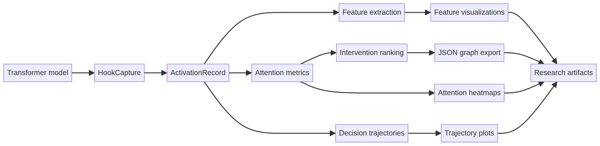

# Architecture



The pipeline diagram is a visual summary of the repository’s boundaries. It describes how implemented records and analyses fit together; it is not a claim that every adapter or intervention runner is already available.

TransInterp is organized as a pipeline with a narrow core contract. Model-specific code converts framework outputs into named tensors; analysis code operates on those tensors without knowing whether the source model is decoder-only, encoder-only, or encoder-decoder.

## Data flow

```text
model + tokenizer
       |
       v
adapter / hook registry ---> ActivationRecord
       |                         |
       |                         +--> feature analysis
       |                         +--> attention metrics
       |                         +--> trajectory builder
       v
metadata + artifacts <------ visualization and reports
```

## Tensor conventions

| Concept | Canonical shape | Meaning |
|---|---|---|
| Hidden state | `(batch, tokens, d_model)` | Residual or block output |
| Attention | `(batch, heads, query_tokens, source_tokens)` | Normalized attention weights |
| Feature scores | `(batch, tokens, features)` | Feature activation or attribution |
| Class logits | `(batch, classes)` | Scores at one analysis point |
| Decision trajectory | `(layers, batch, classes)` | Layer-indexed probabilities |

Every public function should either preserve these conventions or state its transformation in its docstring. Token strings, offsets, padding masks, and model revision belong in metadata rather than being inferred from tensor dimensions.

## Module boundaries

`extraction` owns forward hooks, activation storage, memory policy, and latent feature decomposition (`features.py`: a PCA `FeatureBasis` and a trainable `SparseAutoencoder`). Feature extraction operates on already-captured tensors; it must not itself register hooks or load a model. `attention` owns measurements over normalized attention tensors — entropy, edges, mass, induction-head scoring, and head-similarity clustering (`induction.py`) — plus comparisons of caller-supplied intervention results; it must not load models or imply causality from observational attention alone. `trajectories` owns layer-wise state transitions and ranking summaries. `utils` owns small shape-safe tensor transformations. `visualization` consumes records and analysis outputs and returns figures or JSON-serializable graph data (`attention.py` for heatmaps, `features.py` for feature-space scatter plots, `graph.py` for token-to-token edge export, `trajectory.py` for decision trajectories); it must not perform analysis, only render it.
 `config` contains validation only. The CLI and examples are orchestration layers, not places for hidden analysis logic.

## Artifact contract

A completed run should contain `config.json`, `environment.json`, `metadata.json`, raw or chunked tensor records, summary tables, and figures. Artifact names should include a stable example identifier rather than a timestamp alone. Large tensors should use chunked formats and be accompanied by checksums. Any filtering or aggregation applied before plotting must be represented in metadata.

## Adding a new model adapter

Start with a small adapter that returns named module references and a tokenizer-aware metadata record. Add a fixture-based test that verifies module names, tensor shapes, and mask handling. Do not add architecture-specific conditionals to generic metrics. If a model has unusual output structures, normalize them inside the adapter.

## Reproducibility requirements

Experiments should pin model revisions, use explicit seeds, store the prompt or dataset identifier, and report device and dtype. A visualization is considered reproducible only when it can be regenerated from a saved artifact and configuration without notebook-local variables.

## Reproducibility layer (added in 0.4.0)

The layers above produce measurements; this layer makes them checkable.

```
ExperimentConfig ──> run_experiment ──> ArtifactBundle ──> manifest.json
                          │                                    │
                     provenance                          sha256 per file
                     determinism                       + one fingerprint
```

**Contract.** A bundle is a plain directory. `manifest.json` lists every file
with its SHA-256 digest, plus the environment, the determinism settings, the
config, and any recorded notes. `fingerprint` hashes the per-file digests,
deliberately excluding the manifest itself so two runs on different machines
that produced identical numbers share a fingerprint.

**Why raw tensor buffers.** Tensors are written as `.bin` files with shape and
dtype recorded in the manifest, not through `torch.save`. `torch.save` emits a
zip archive containing timestamps, so two identical runs would produce
different bytes and every digest comparison would be meaningless.

**dtype promotion.** `bfloat16` has no NumPy equivalent, so it is promoted to
`float32` on write and restored on read. The promotion is lossless and both
dtypes are recorded.

## Intervention layer (added in 0.4.0)

`transinterp.interventions` executes causal interventions. It holds no
model-specific knowledge: it takes a mapping of names to `nn.Module` objects,
so the same code serves a Hugging Face causal LM or a toy model in a test.

**Patches target module outputs.** Patching `layer.3.mlp` replaces what that
MLP contributed, not the residual stream downstream of it. These are different
claims and the distinction matters when reporting a result.

**Protocol selection is automatic and recorded.** `replace` and `add` patch
clean activations into a corrupted run (denoising). `zero` and `mean` ablate
during the clean run (noising), because zeroing a component in an
already-corrupted pass would conflate two interventions. The chosen protocol
is written into each result's metadata.

**Two invariants pin the implementation**, both covered by tests: patching a
module with its own cached output must be a no-op, and patching the final
block must restore normalized effect to exactly 1.0.
